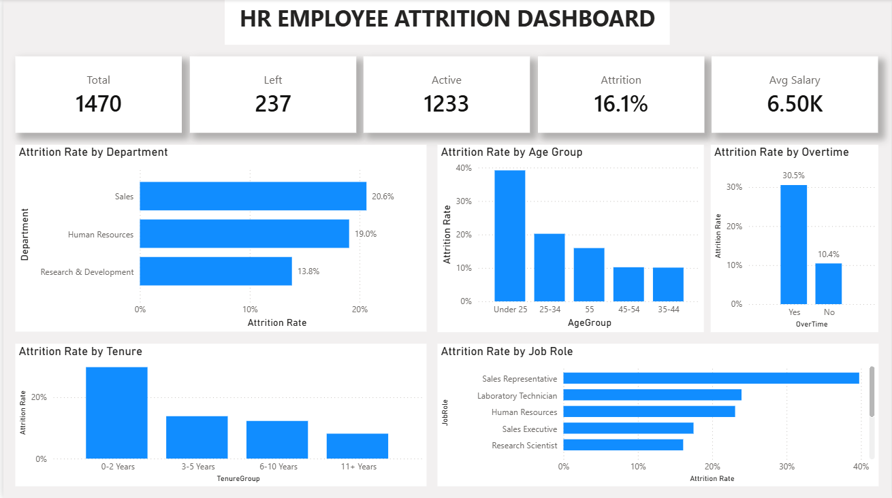
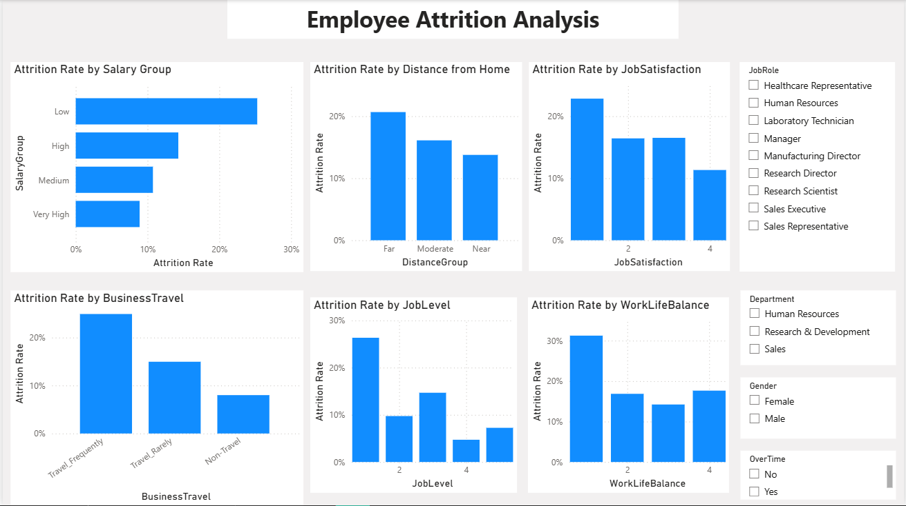

# HR Employee Attrition Analysis — Power BI

## 📊 Project Overview

An interactive Power BI project designed to analyze employee attrition and identify workforce patterns that may help HR teams improve employee retention.

The analysis focuses on employee turnover, compensation, overtime, departments, job roles, age, distance from work, tenure, job satisfaction, and other workforce characteristics.

---

## 🎯 Business Problem

The HR team wants to understand:

* How many employees have left the organization?
* Which departments and job roles have higher attrition?
* Is overtime associated with higher employee turnover?
* Is lower salary associated with higher attrition?
* Does distance from the workplace relate to employee turnover?
* Which employee groups appear more vulnerable to attrition?

---

## 🔎 Objectives

* Measure total employees, active employees, and employees who left.
* Calculate overall employee attrition rate.
* Analyze attrition by department and job role.
* Compare attrition between employees working overtime and those who do not.
* Analyze the relationship between salary levels and attrition.
* Analyze attrition by age, tenure, distance, and job satisfaction.
* Provide data-driven recommendations for HR decision-making.

---

## 🗂️ Dataset

The dataset contains **1,470 employee records** and was analyzed using Power BI.

The dataset includes employee demographics, job information, compensation, overtime, satisfaction, experience, and attrition information.

---

## 🛠️ Tools & Technologies

* Power BI
* Power Query
* DAX
* Data Visualization
* Data Cleaning & Transformation
* Exploratory Data Analysis

---

## 🧹 Data Preparation

The data preparation process included:

* Data profiling and quality checks.
* Data type validation.
* Missing-value and error checks.
* Removal of constant/non-informative columns.
* Creation of analytical categories:

  * Age Group
  * Salary Group
  * Distance Group
  * Tenure Group
* Creation of sorting columns for categorical analysis.

---

## 🧮 Key KPIs

| KPI                    |      Value |
| ---------------------- | ---------: |
| Total Employees        |      1,470 |
| Employees Left         |        237 |
| Active Employees       |      1,233 |
| Attrition Rate         |      16.1% |
| Average Monthly Income |      6,503 |
| Average Tenure         | 7.01 Years |

---

## 📈 Key Insights

### 1. Age

Employees under 25 have the highest attrition rate at **39.2%**.

### 2. Overtime

Employees working overtime have a substantially higher attrition rate (**30.5%**) compared with employees who do not work overtime (**10.4%**).

### 3. Tenure

Employees with 0–2 years of tenure have the highest attrition rate at **29.8%**.

### 4. Salary

The Low Salary Group has the highest attrition rate at **25.3%**.

Employees who left also had a lower average monthly income (**4,787**) than employees who stayed (**6,833**).

### 5. Distance

Employees in the Far Distance Group have a higher attrition rate (**20.7%**) compared with employees in the Near Group (**13.8%**).

### 6. Job Satisfaction

Employees with the lowest job satisfaction level have a higher attrition rate (**22.8%**) than employees with the highest satisfaction level (**11.3%**).

### 7. Department

Sales has the highest attrition rate among the three departments at **20.6%**.

---

## 💡 HR Recommendations

Based on the observed patterns:

* Review overtime workload and staffing practices.
* Strengthen onboarding and retention programs for early-tenure employees.
* Review compensation levels for lower-paid roles with elevated attrition.
* Investigate employee satisfaction through surveys and exit interviews.
* Explore transportation or flexible-work options for employees with longer commuting distances.

> **Note:** The analysis identifies associations between attrition and several workforce factors. These findings do not establish causation.

---

## 📊 Dashboard

### Executive Overview



### Employee Deep Dive



---

## 📁 Repository Structure

```text
hr-employee-attrition-analysis/
│
├── README.md
├── data/
├── powerbi/
├── screenshots/
└── documentation/
```

---

## 👤 Author

**Salah Alrhabi**

Data Analyst | Power BI | SQL | Python | Excel
